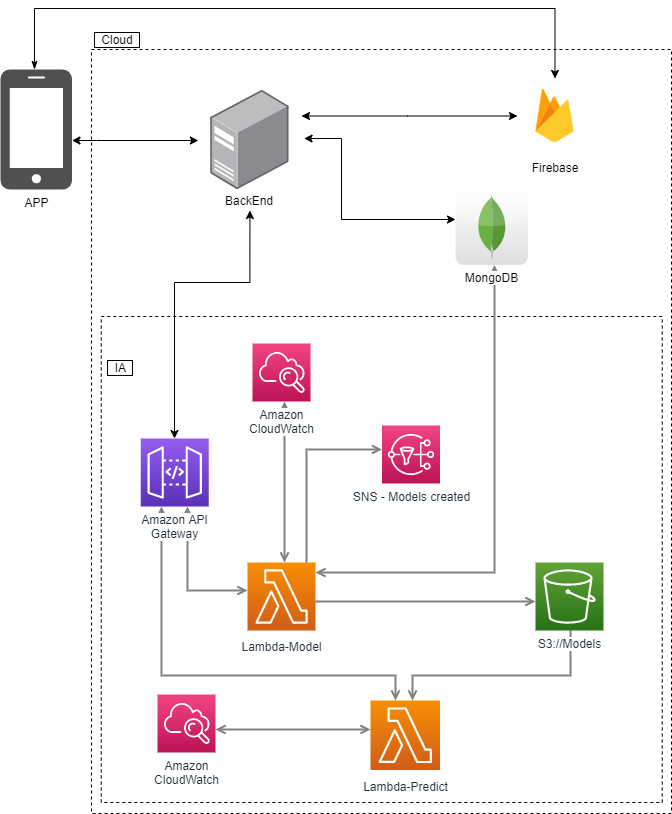
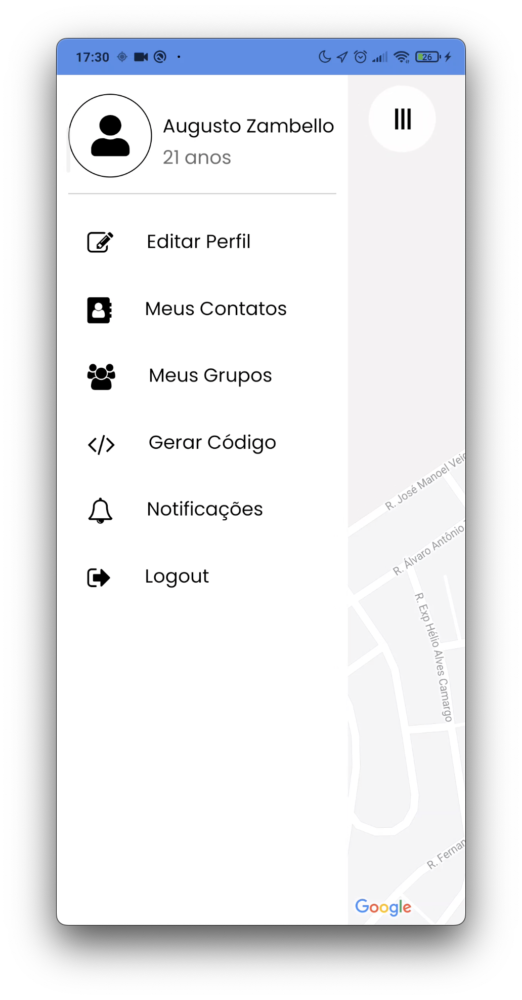
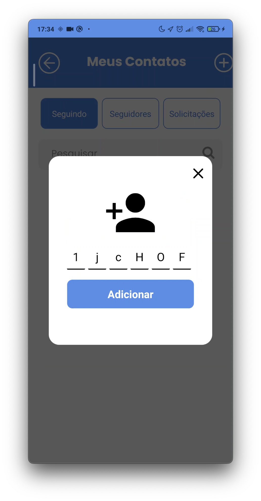
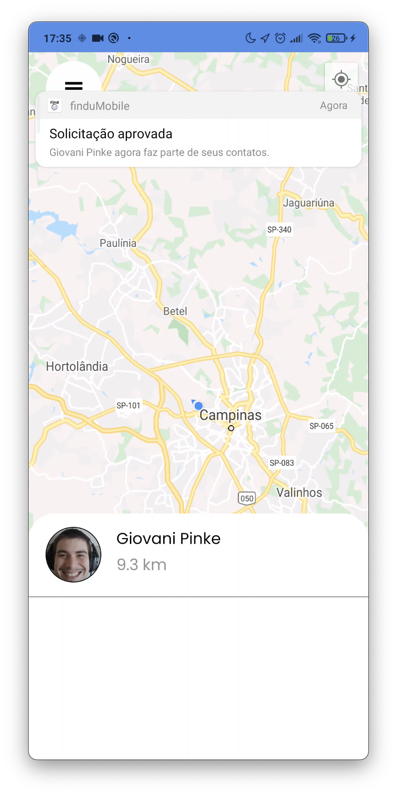
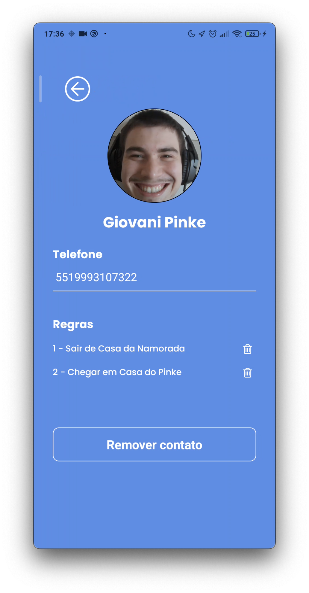

# finduMobile
Location App with React Native

> Project Architecture

> Splash screen

> Welcome screen

> Menu screen

> Add Friend screen

> Friend Request Approved

> Manage your friends rules
